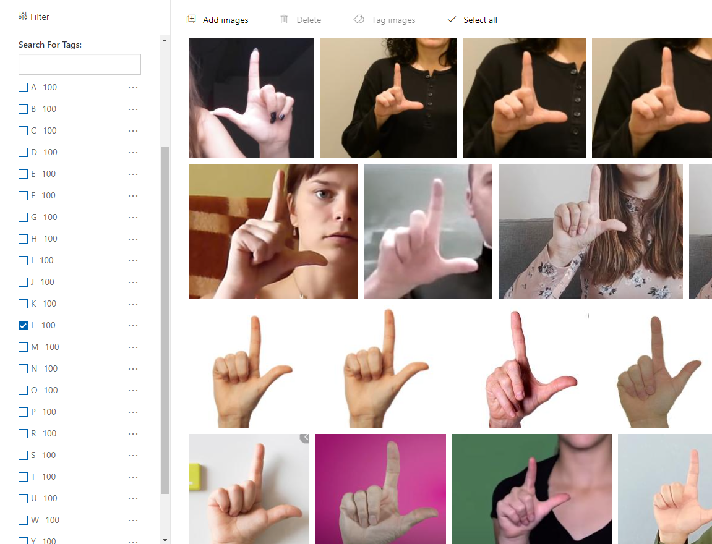
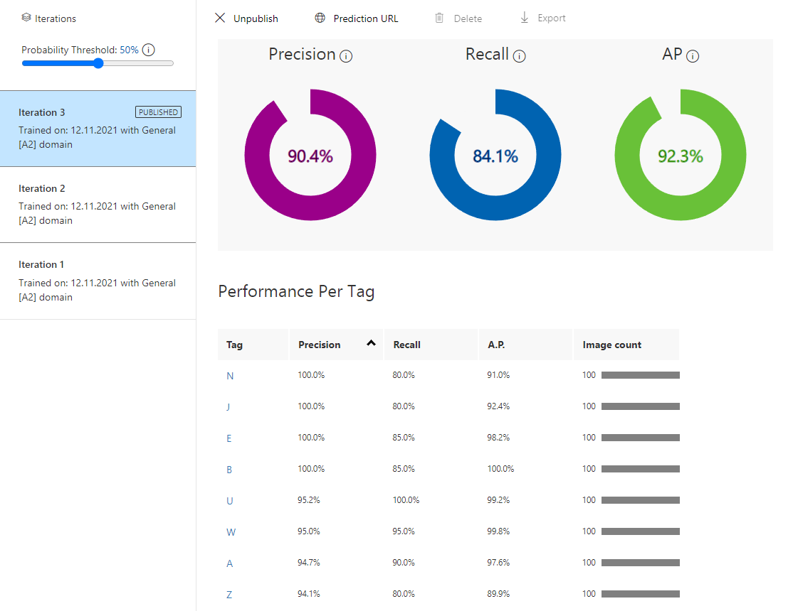
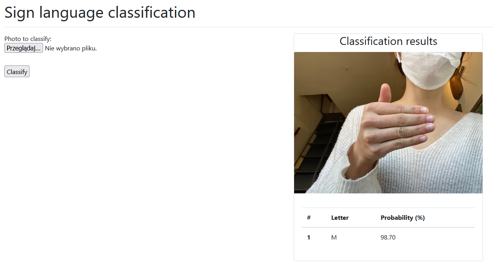
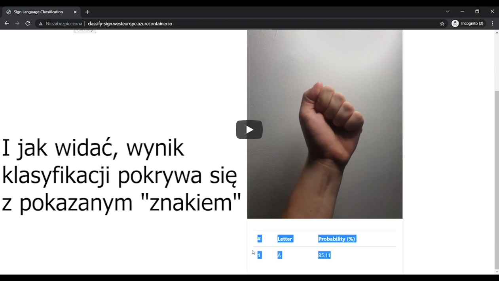

# Polish-Sign-Language-Classification

## Cel projektu

Celem projektu było stworzenie serwisu do rozpoznawania polskiego alfabetu migowego na podstawie przesłanego zdjęcia (możliwe formaty: .jpg, .png, .bmp).

## Skład zespołu

* Damian Jaczarek - [github](https://github.com/janczarek99)
* Hubert Piłka - [github](https://github.com/MrBallOG)

## Stos technologiczny

* Python (Flask)
* Docker
* Azure Custom Vision
* Azure Container Services:
  * Container Instances
  * Container Registry

## Diagram architektury

## Sposób działania

Główną częścią aplikacji jest serwis Custom Vision, który przetwarza obrazy przy pomocy klasyfikacji wieloklasowej, która pozwala przypisać jednemu obrazowi dokładnie jedną klasę. W celu wyuczenia modelu do rozpoznawania polskiego języka migowego stworzony został specjalny zbiór danych, którego przeważająca większość obrazów pochodzi ze zbioru udostępnionego na stonie [dataverse.harvard.edu](https://dataverse.harvard.edu/dataset.xhtml?persistentId=doi:10.7910/DVN/K142HP), a także własnych przeszukiwań internetu. Zdjęcia zostały załadowane do serwisu Custom Vision, a następnie otagowane.

Jak się okazało statyczna interpretacja znaków polskiego języka migowego jest właściwie niewykonalna, gdyż różnice między znakami diakrytycznymi, a ich odpowiednikami wynikają z ruchu ręki. W związku z tym model został uproszczony do rozpoznawania podstawowych znaków (a, b, c..., z). Następnie model został wytrenowany.

Otrzymany w wyniku model został opublikowany w formie API, dostępnego za podaniem klucza. W celu umożliwienia interakcji z modelem powstała aplikacja webowa we Flask'u, która w formie kontenera została dodana do serwisu Container Registry i tam zbudowana. Następnie przy pomocy serwisu Container Instances aplikacja została wdrożona. Interfejs użytkownika jest bardzo prosty, wystarczy dodać lokalny plik (klikając "Przeglądaj..."), a następnie nacisnąć przycisk "classify". Następnie po prawej stronie ekranu wyświetli się przesłany obraz, a pod nim informacja o wykrytym znaku.

Link do strony - <http://classify-sign.westeurope.azurecontainer.io/>

## Demo rozwiązania

## Reprodukcja rozwiązania

Poniżej znajdują się dwa przyciski, które służą do szybkiego wdrożenia serwisów użytych do stworzenia naszej aplikacji przy użyciu szablonów ARM (Azure Resource Manager).

### Custom Vision

### Container Services

